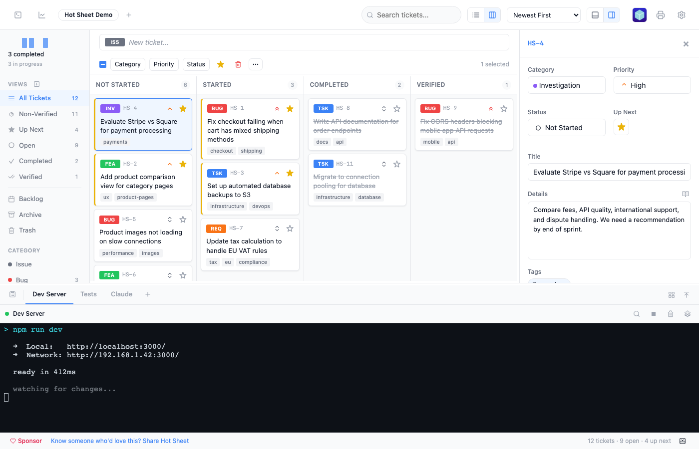
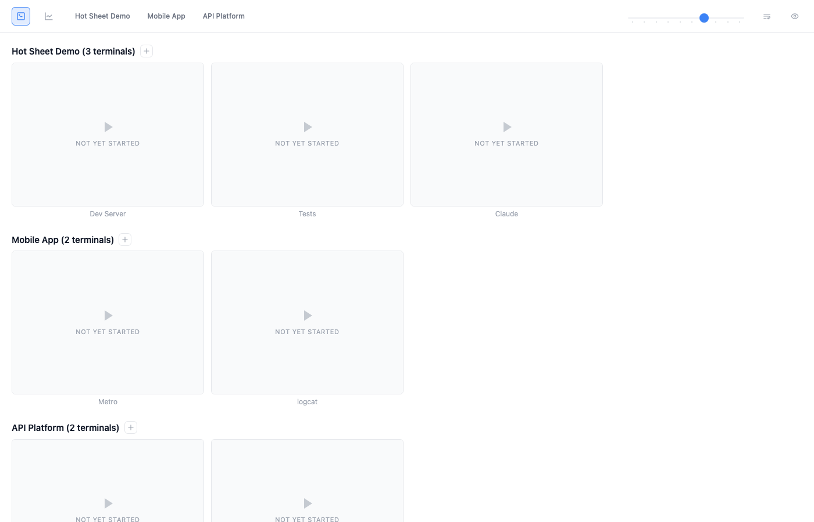
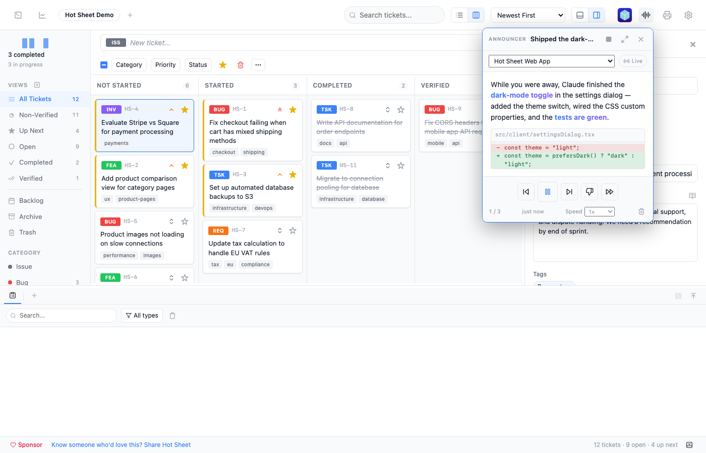
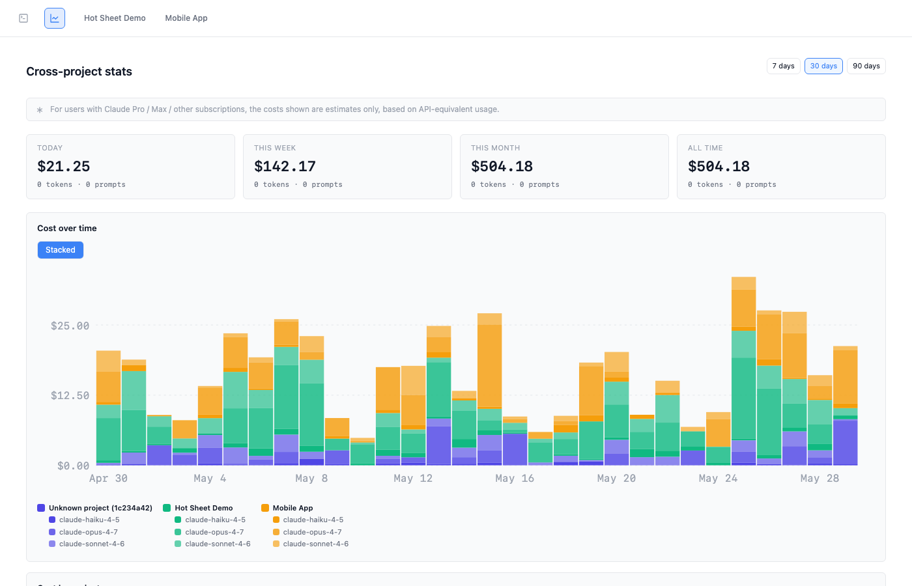

<div align="center">

# Hot Sheet

### A fast, local ticket tracker that feeds your AI coding tools.

<br>

> **hot sheet** *(noun)* — a document or report listing items of high current interest, typically featuring urgent, new, or updated information.

<br>

**Hot Sheet** is a local-first project management tool wired into your AI coding workflow. Create tickets with a bullet-list interface, drag them into priority order, and your AI tools automatically get a structured worklist they can act on. A real PTY-backed terminal lives in the footer drawer — switch to the dashboard view to see every terminal across every project as a tile grid — so you can keep an eye on dev servers, tests, and the AI's own Claude Code session from the same window. Step away, and the **Announcer** narrates what the AI got done while you were gone.

No cloud. No logins. No JIRA. Just tickets, terminals, and a tight feedback loop.

<br>

**Desktop app** (recommended) — download from [GitHub Releases](https://github.com/brianwestphal/hotsheet/releases):

| Platform | Download |
|----------|----------|
| macOS (Apple Silicon) | `.dmg` (arm64) |
| macOS (Intel) | `.dmg` (x64) |
| Linux | `.AppImage` / `.deb` |
| Windows | `.msi` / `.exe` |

After installing, open the app and use **Open Folder** to get started — or click **Install CLI** to add the `hotsheet` command to your PATH for terminal launching.

**Or install via npm:**

```bash
npm install -g hotsheet
```

Then, from any project directory:

```bash
hotsheet
```

That's it. Data stays local.

> **Platform support.** Hot Sheet is designed to run on macOS, Linux, and Windows, but **active development and testing happens on macOS only.** Linux and Windows builds come out of the same Tauri release pipeline and the platform-specific code paths are written to be cross-platform, but cross-platform regressions may go undetected between releases. **Help from users on other platforms is welcome** — bug reports, reproduction steps, and PRs fixing platform-specific issues are all actively appreciated. Please [open an issue](https://github.com/brianwestphal/hotsheet/issues) if you hit something on Linux or Windows.

</div>

<br>

<p align="center">
  
</p>

---

## Why Hot Sheet?

AI coding tools are powerful, but they need direction. You know what needs to be built, fixed, or investigated — but communicating that to your AI tool means typing the same context over and over, or maintaining a text file that drifts out of sync.

Hot Sheet gives you a proper ticket interface — categories, priorities, statuses — with one key difference: it automatically exports a `worklist.md` file that AI tools like Claude Code can read directly. Your tickets become the AI's task list.

The workflow:

1. **You** create and prioritize tickets in Hot Sheet
2. **Hot Sheet** syncs an `Up Next` worklist to `.hotsheet/worklist.md`
3. **Your AI tool** reads the worklist and works through it
4. **You** review, give feedback, and add new tickets

The loop stays tight because the AI always knows what to work on next — and you always know what it's doing.

---

## Features

**Bullet-list input** — type a title, hit Enter, ticket created. Set category and priority inline with keyboard shortcuts.

<p align="center">
  
</p>

**Customizable categories** — defaults to a software development set (Issue, Bug, Feature, Req Change, Task, Investigation), with built-in presets for Design, Product Management, Marketing, and Personal workflows. Each category has a color, badge label, and keyboard shortcut — all configurable in Settings.

<p align="center">
  
</p>

**Column view** — switch to a kanban-style board grouped by status. Drag tickets between columns to change status. Click column headers to select all tickets in a column. Drag onto sidebar items to set category, priority, or view.

<p align="center">
  
</p>

**Batch operations** — select multiple tickets to bulk-update category, priority, status, or Up Next. The overflow menu provides duplicate, tags, mark as read/unread, move to backlog, and archive actions — all with icons. Right-click any ticket for a full context menu with submenus.

<p align="center">
  
</p>

**Detail panel** — side or bottom orientation (toggle in the toolbar), resizable, collapsible. Shows category, priority, status, and Up Next in a compact grid, plus title, details, tags, attachments, and editable notes. Click a note to edit inline; right-click to delete. **Reader mode** (book icon) opens any note — or the details body — in a distraction-free overlay that you can step through with chevrons or arrow keys without re-clicking the icon.

<p align="center">
  
</p>

**Embedded terminal** — a real PTY-backed terminal lives in the footer drawer next to the commands log. Configure multiple named terminals per project (dev server, tests, build, a Claude session, anything else), each with its own theme, font, and per-terminal shell-history pool — up-arrow on the dev-server tab won't surface the commit messages you typed on the deploy tab. **11 curated themes** (Default, Dracula, Solarized Dark/Light, Nord, Gruvbox, Monokai, One Dark, Tomorrow Night, GitHub Dark/Light) and 11 monospaced font choices, settable as a project default OR per-terminal via the gear popover. Right-click tabs to close, drag-to-reorder, single + button to spawn a one-off dynamic terminal. A macOS-Terminal.app-style quit-confirm catches Cmd+Q when long-running processes (claude, npm dev, anything heavier than an idle shell) are alive so you don't lose them by accident.

**Shell integration that earns its keep** — xterm.js renders the buffer and Hot Sheet parses every standard shell-integration escape: **OSC 7** drives a cwd-aware toolbar chip you can click to open the working directory in Finder/Explorer; **OSC 8** makes hyperlinks emitted by `gh`, `cargo`, `ls --hyperlink=auto`, etc. actually clickable; **OSC 9** fires desktop toasts AND native OS notifications (system Notification Center / tray) when the window is backgrounded; **OSC 133** marks every prompt with a gutter glyph, supports `Cmd+Up`/`Cmd+Down` to jump between commands, and a hover popover with **Copy command** / **Copy output** / **Rerun** / **Ask Claude about this** buttons. A bell character (`\x07`) bounces the terminal tab and persists an accent outline until you visit it — and bells fired in **another project's** terminal surface as a dot on that project's tab so you don't miss them.

**Terminal dashboard** — click the `square-terminal` button in the toolbar to enter a dedicated full-window view showing every terminal across every registered project as a grid of 4:3 tiles. Tiles stay live (xterm + scrollback + PTY all preserved); bells bounce the tile and outline it; the column-count slider scales the whole grid from "one giant tile" to "10-per-row dense overview." **Single-click** a tile to magnify it to ~70% viewport with keyboard input; **double-click** to enter a dedicated full-pane view that resizes the PTY to fit. **Shift+Cmd+Arrow** (macOS) / **Shift+Ctrl+Arrow** (Linux/Windows) walks to the next-magnified-target tile in the indicated direction — perfect for cycling through a row of build/test pipelines. **Hide / Show Terminals** with named **visibility groupings** (e.g. "claude only", "server logs", "single app") so you can switch contexts without re-toggling rows. A **flow layout mode** flattens projects into a single tagged grid; **sectioned mode** groups by project. Off-screen tiles unmount their xterm to keep memory tame; the PTY stays alive server-side so the bytes are waiting when you scroll back.

**Unread indicators** — when tickets are created or updated externally (by AI tools, sync plugins, or the API), a blue dot appears next to the title. Your own edits in the UI never trigger unread status. Mark as Read/Unread from the context menu or batch toolbar. Tickets are automatically marked as read when you open them in the detail panel.

**Git status tracker** — auto-detected sidebar chip shows your current branch, dirty-file count, and ahead/behind upstream commits. Click to expand a popover with the file lists; one-click `git fetch` updates remote counts without leaving Hot Sheet. Silent no-op for non-git projects.

**Stats dashboard** — click the sidebar widget to open a full analytics page with throughput charts, created-vs-completed trends, cumulative flow diagram, category breakdown, and cycle time scatter plot. Hover any chart for detailed tooltips.

<p align="center">
  
</p>

<p align="center">
  
</p>

<p align="center">
  
</p>

**Multi-project tabs** — open multiple projects in a single window. Each project remembers its own sidebar view, settings, sort preferences, and layout. Tabs appear automatically when you register a second project via Open Folder (`Cmd+O`). Drag tabs to reorder, right-click for close options and "Show in Finder," switch with `Cmd+Shift+[/]`.

<p align="center">
  
</p>

**Also includes:**
- **Tags** — free-form tags on tickets, with autocomplete and a batch tag dialog for multi-select
- **Custom views** — create filtered views with an interactive query builder (field + operator + value conditions, AND/OR logic). Associate a tag with a view to enable drag-and-drop tagging and auto-tag on create.
- **Custom ticket prefix** — change the default `HS-` prefix to any project-specific prefix in Settings
- **Five priority levels** — Highest to Lowest, with Lucide chevron icons, sortable and filterable
- **Up Next flag** — star tickets to add them to the AI worklist
- **Drag and drop** — drag tickets onto sidebar views to change category, priority, or status; drop files onto the detail panel to attach; reorder project tabs and custom views
- **Right-click context menus** — full context menu on tickets with category/priority/status submenus, tags, duplicate, mark as read/unread, backlog, archive, delete
- **Search** — full-text search across ticket titles, details, ticket numbers, and tags. When matches sit in the backlog or archive, gray "Include N backlog / N archive" rows surface under the search bar so you can mix them in with one click without leaving the current view
- **Ticket cross-references** — `HS-NNNN`-style references inside notes, details, and reader-mode become clickable links that open a stacking modal showing the referenced ticket; click another reference inside that modal to push it onto the stack
- **Print** — print the dashboard, all tickets, selected tickets, or individual tickets in checklist, summary, or full-detail format
- **Keyboard-driven** — `Enter` to create, `Cmd+I/B/F/R/K/G` for categories, `Alt+1-5` for priority, `Cmd+D` for Up Next, `Delete` to trash, `Cmd+P` to print, `Cmd+Z/Shift+Z` for undo/redo
- **Undo/redo** — `Cmd+Z` and `Cmd+Shift+Z` for all operations including notes, batch changes, and deletions
- **Animated transitions** — smooth FLIP animations when tickets reorder after property changes
- **Copy / cut / paste** — `Cmd+C` copies selected tickets (formatted text to clipboard + structured data for paste), `Cmd+X` cuts, `Cmd+V` pastes into the current project with title dedup. Works across projects.
- **File attachments** — attach files via file picker or drag-and-drop onto the detail panel, reveal in file manager. Feedback-dialog drafts also save their attachments — Save Draft persists files alongside the text so you can pick up where you left off.
- **Markdown sync** — `worklist.md` and `open-tickets.md` auto-generated on every change
- **Automatic backups** — tiered snapshots (every 5 min, hourly, daily) with preview-before-restore recovery. A **Database Repair** panel in Settings can find a working backup automatically and run `pg_resetwal` if the live cluster ever needs it.
- **Auto-cleanup** — verified tickets auto-archive after a configurable number of days; trashed tickets auto-delete
- **Portable settings** — all project settings stored in `settings.json` for easy copying between projects
- **App icon variants** — 9 icon variants to choose from in Settings, applied instantly to the dock icon
- **Fully local** — embedded PostgreSQL (PGLite), no accounts, nothing phones home. The Claude Code cost telemetry is captured to a localhost-bound endpoint and never leaves your machine; the only outbound network activity is the stuff you opt into (desktop-app update checks, plugin sync you configure).

---

## AI Integration

The exported worklist is plain markdown. Any AI tool that can read files can use it.

Star tickets as "Up Next" and they appear in the worklist, sorted by priority. As the AI works, it updates ticket status and appends notes — visible right in the detail panel. Tickets modified by the AI show a blue unread dot so you know what to review.

<p align="center">
  
</p>

### Claude Code

Point Claude Code at your worklist:

```
Read .hotsheet/worklist.md and work through the tickets in order.
```

Or add it to your `CLAUDE.md`:

```markdown
Read .hotsheet/worklist.md for current work items.
```

Hot Sheet automatically generates skill files for Claude Code (as well as Cursor, GitHub Copilot, and Windsurf) so your AI tool can create tickets directly. Run `/hotsheet` in Claude Code to process the worklist.

### Recommended project instructions

Hot Sheet works best when your AI assistant follows a few conventions: drive work through Hot Sheet tickets, keep double test coverage, and keep requirements docs in sync. Add these sections to your project's `CLAUDE.md` (Claude Code) — Hot Sheet can do it for you, or copy them by hand.

- **Automatic:** when Hot Sheet detects Claude Code in a project, it offers (once per project) to add these sections to your `CLAUDE.md`. Your existing file is preserved — the sections are wrapped in markers so Hot Sheet can keep them up to date without touching anything else, and the test/docs *specifics* are filled in by your assistant for that project.
- **Manual:** click **Update CLAUDE.md** in **Settings → General** at any time, or copy the blocks below.

<details>
<summary><strong>Ticket-Driven Work</strong></summary>

```markdown
## Ticket-Driven Work

When the user gives you work directly (not via the Hot Sheet channel or events), create Hot Sheet tickets before starting implementation — especially for substantial or multi-step work.

- **Do create tickets** for: features, bug fixes, refactoring, multi-step tasks, anything changing code. **Don't** for: simple questions, git commits, quick lookups, trivial one-liners. **When in doubt, create them.**
- Create via the Hot Sheet API (prefer the `hotsheet_*` MCP tools), mark Up Next, then work through them: set status `started` → implement → set `completed` with notes.
- **Always create follow-up tickets** for incomplete work (unfinished steps, open design questions, known gaps, designed-but-unbuilt features). If it's not in a ticket, it's forgotten.
- **Incomplete-work checklist** — before marking a ticket `completed`, file follow-ups for any: (1) UI placeholder text ("coming soon"), (2) TODO/FIXME comments, (3) documented-but-unimplemented requirements, (4) empty/stub functions returning mock data.
- **Use FEEDBACK NEEDED before deferring or asking about follow-ups.** When about to (a) defer a ticket needing more work, (b) ask whether to file follow-ups, or (c) close with a question buried in notes — DON'T. Leave the ticket `started`, add a `FEEDBACK NEEDED:` note (per `.hotsheet/worklist.md`), signal channel done, and wait. It's the only reliable way to surface a question.
```

</details>

<details>
<summary><strong>Testing Philosophy</strong></summary>

```markdown
## Testing Philosophy

- **Double coverage**: every feature covered by both unit tests AND E2E tests. Unit = logic in isolation; E2E = real user flows through the running app with minimal mocking.
- **Unit tests**: Mock external deps (filesystem, network), test real logic.
- **E2E tests**: As much as possible, use test automation tools to run realistic, user-facing flows. Minimize mocks.
- **Coverage**: Merge all test coverage (e.g. unit, E2E server, E2E browser) into one report. Low-coverage files should get more of both test types. Aim for 100% coverage of code lines, 100% coverage of branches, and 100% of features described in the requirements documentation.
- **Manual test plan**: keep a manual test plan doc (e.g. `docs/manual-test-plan.md`) for features that can't be reliably automated. **Keep it up to date** — add such features there; when you add automated coverage for a previously-manual item, remove it and note it in an "Automated Coverage Summary".
- **Always fix lint and type errors before finishing**: Fix as you go, don't batch.
```

When Hot Sheet adds this section it also scaffolds a self-healing **"this project's test setup"** block: a short prompt that asks your assistant to detect and record the project's actual test runner, file locations, and commands the first time it does test work — so the generic principles get project-specific teeth for any language.

</details>

<details>
<summary><strong>Requirements Documentation</strong></summary>

```markdown
## Requirements Documentation

Keep human-readable requirements documents as the source of truth for what the project does, and **keep them up to date in the same change as the code** (add/remove/modify a requirement → update its doc). Create new docs for major new functional areas. Cross-reference related docs with relative links.

### AI Summaries

Maintain two synthesis docs an AI assistant reads at the start of a fresh session — keep them in sync with reality (source doc/code wins on conflict), and prefer small targeted edits over rewrites:

- A **codebase map** — directory tree, entry points, data schema, build, tests, settings, and a "where do I look for X" index. Update it in the same change when you add a file or directory, add a route/endpoint, change the schema, add a client module, or add a setting key.
- A **requirements summary** — a synthesized view of every requirements doc with status markers (e.g. Shipped / Partial / Design only / Deferred). Update it in the same change when you add a requirements doc, ship a design-only feature, or defer/regress a shipped one.
```

</details>

See [docs/86-ai-assistant-setup.md](docs/86-ai-assistant-setup.md) for how the auto-install / auto-update mechanism works.

### Claude Channel Integration (Experimental)

Hot Sheet can push events directly to a running Claude Code session via MCP channels. Enable it in Settings:

- **Play button** — appears in the sidebar. Single-click sends the worklist to Claude on demand. Pending worklist changes are flushed immediately so the AI always reads up-to-date data.
- **Auto mode** — double-click the play button to enable automatic mode. Claude is triggered immediately, then continues monitoring for new Up Next items with debounce. Exponential backoff prevents runaway retries.
- **Auto-prioritize** — when no tickets are flagged as Up Next, Claude automatically evaluates open tickets and picks the most important ones to work on.
- **Feedback loop** — Claude can request user input by adding notes prefixed with `FEEDBACK NEEDED:` or `IMMEDIATE FEEDBACK NEEDED:`. A rich dialog appears in the UI with inline-response slots between every prompt block, a catch-all field, and file attachment support. Save Draft to come back later (text + attachments survive); Submit re-triggers Claude with your response. Blue dots on project tabs indicate pending feedback.
- **Custom commands** — create named buttons that send custom prompts to Claude **or run shell commands** directly. Organize into collapsible groups. Toggle between "Claude Code" and "Shell" targets per command. Shell commands execute server-side with stdout/stderr streamed to the commands log in real time. **Long-press** a button for a secondary action (a shell command runs in a fresh terminal; a Claude command files a task ticket), and **hover** any button to see when it last ran.
- **Permission relay** — when Claude needs tool approval (Bash, Edit, etc.), a full-screen overlay shows the tool name and command preview with Allow/Deny/Dismiss buttons — no need to switch to the terminal. Per-project **allow-rules** can auto-approve specific tool+pattern pairs (e.g. always allow `Bash:npm test`) so trusted commands skip the overlay entirely.
- **Commands log + embedded terminal** — the footer drawer hosts both a resizable commands log (every trigger, completion, permission request, shell output) AND tabs for any number of project-scoped terminals. Hop between an `npm run dev` terminal, the Claude session, and the audit log without leaving Hot Sheet.
- **MCP tools** — Claude Code sees Hot Sheet as a connected MCP server with schema-validated tools: `hotsheet_create_ticket`, `hotsheet_update_ticket`, `hotsheet_query_tickets`, `hotsheet_batch`, `hotsheet_signal_done`, `hotsheet_request_feedback`, `hotsheet_announce`, and 8 more. Tickets, notes, and attachments all round-trip without the AI hand-crafting curl commands.
- **Status indicator** — shows "Claude working" / "Shell running" / idle in the footer.

Requires Claude Code v2.1.80+ with channel support. See [docs/12-claude-channel.md](docs/12-claude-channel.md) for setup details.

<p align="center">
  
</p>

### Announcer — narrated playback of project work (Beta)

Step away while Claude works, and the **Announcer** catches you up. It turns completion notes, the command log, and Claude Code's own telemetry stream into a short spoken-and-visual digest — a draggable, resizable picture-in-picture transcript that reads each update aloud, emphasizes the key phrases, and shows the actual before/after code diff for the change it's describing.

- **After-the-fact digest** — click **Listen** to hear everything that happened since you last checked in, narrated in order. The PIP shows the running transcript with playback controls (play/pause, previous, next, speed) and tier-1 emphasis on the phrases that matter.
- **Live mode** — narrates work as it happens, coalescing bursts of activity into coherent entries and learning from the ones you skip. It's **off unless you're listening** — a client-renewed lease gates generation so it never spends your key in the background, with a per-project call budget on top.
- **Cross-project** — an "All Projects" context interleaves every enabled project's reel chronologically, each entry tagged with a project chip and prefixed with its project name when spoken.
- **Spoken permission checks** — hear "Permission needed in *Project*: …" read aloud when Claude needs tool approval, even with no PIP open and no API key required.
- **Bring your own model — or none** — summarize with your Anthropic key, **on-device with Apple Foundation Models** (macOS 26, free and fully private, no key), or a local **Ollama / OpenAI-compatible** endpoint. Playback uses the built-in OS/browser voice by default.
- **Code-diff visuals** — the working agent can hand the Announcer the exact before/after through the `hotsheet_announce` MCP tool, rendered inline in the PIP next to the narration.

API keys are managed once in **Settings → API Keys** — a machine-global registry of named keys stored in the OS keychain, selected by name per project so you never paste a secret twice. Enable narration in **Settings → Announcer**.

<p align="center">
  
</p>

### Telemetry & Cost Tracking

**On by default** (HS-8684 — opt out per project via Settings → Telemetry). Hot Sheet stamps Claude Code's spawn env so its OpenTelemetry exporter posts cost / token / latency events back to a localhost-bound endpoint. The data drives several surfaces:

- **Today's cost widget** in the sidebar — total spend across today's Claude prompts in this project, updated as the channel ticks. A `*` superscript reminds Pro / Max subscribers the figure is the API-equivalent cost, not what they actually pay.
- **Per-project analytics dashboard** gains a **Claude usage** section below the ticket charts: window-total chips (today / week / month / all-time), a cost-over-time chart, cost-by-model donut, per-tool latency histograms, and the 10 most recent prompts — click any row for a timeline drilldown showing every event with its attribute / body JSON.
- **Cross-project stats page** (header-bar `line-chart` icon, visible when any project has telemetry on) — cost rollup across every loaded project: window-total chips, a by-project stacked cost-over-time chart, sortable cost-by-project table, model donut, and a 7×24 hourly-activity heatmap for the trailing 90 days.
- **Per-ticket Claude usage** — when you trigger Claude via the channel with an active ticket selected, Hot Sheet prepends an invisible `<!-- hotsheet:ticket=HS-NNNN -->` marker to the prompt so the cost / tokens / wall-clock from that work attribute back to the ticket and appear as a "Claude usage on this ticket" block in the detail panel.
- **Beta enhanced tracing** — separate toggle wires `CLAUDE_CODE_ENHANCED_TELEMETRY_BETA=1` so each prompt's drilldown switches from a flat event timeline to a parent-child span tree with an inline waterfall chart. New `claude` sessions started after the toggle begin capturing spans.

Security model: localhost-bound OTLP receiver + `hotsheet_project` resource-attribute filter — foreign OTLP traffic from other tools on the same machine can't pollute Hot Sheet's tables even if it tries. Telemetry is stored per-project with a configurable retention window (30-day default) enforced by a periodic sweep with per-table windows and a row cap, so the database can't grow without bound; **Clear telemetry data** in Settings wipes the project's rows on demand.

<p align="center">
  
</p>

### Other AI Tools

The worklist works with any AI tool that reads files — Cursor, Copilot, Aider, etc. Each ticket includes its number, type, priority, status, title, and details.

### What gets exported

`worklist.md` contains all tickets flagged as "Up Next," sorted by priority:

```
# Hot Sheet - Up Next

These are the current priority work items. Complete them in order of priority, where reasonable.

---

TICKET HS-12:
- Type: bug
- Priority: highest
- Status: not started
- Title: Fix login redirect loop
- Details: After session timeout, the redirect goes to /login?next=/login...

---

TICKET HS-15:
- Type: feature
- Priority: high
- Status: started
- Title: Add CSV export for reports
```

---

## Plugins

Hot Sheet supports plugins for syncing with external ticketing systems and adding custom functionality. Plugins are loaded from `~/.hotsheet/plugins/` and configured per-project.

### GitHub Issues (bundled)

The GitHub Issues plugin ships with Hot Sheet and syncs tickets bidirectionally:
- Pull issues from GitHub, push local tickets to GitHub
- Map categories, priorities, and statuses via configurable labels
- Sync notes as GitHub comments, push attachments via the Contents API
- Toolbar sync button with busy indicator

Configure it in Settings → Plugins with your GitHub PAT and repository details.

### Building Plugins

Plugins are ESM JavaScript modules with a `manifest.json`. They can:
- **Sync tickets** with any external system (Linear, Jira, Trello, Asana, etc.)
- **Add UI elements** — toolbar buttons, sidebar actions, context menu items
- **Run custom actions** — export, notifications, webhooks, automation

See **[`docs/plugin-development-guide.md`](docs/plugin-development-guide.md)** for the complete plugin API reference, including a full Linear plugin skeleton and standalone TypeScript types. The guide is designed to be read by both humans and AI coding assistants — point Claude Code or another AI tool at it to generate plugins for systems it already knows.

---

## Backups & Data Safety

Hot Sheet automatically protects your data with tiered backups and instance locking.

### Automatic backups

Backups run on three schedules, each keeping a rolling window of snapshots:

| Tier | Frequency | Retention |
|------|-----------|-----------|
| Recent | Every 5 minutes | Last hour (up to 12) |
| Hourly | Every hour | Last 12 hours (up to 12) |
| Daily | Every day | Last 7 days (up to 7) |

You can also trigger a manual backup at any time from the settings panel with the **Backup Now** button.

### Recovering from a backup

Open the settings panel (gear icon) to see all available recovery points grouped by tier. Click any backup to enter **preview mode** — the app switches to a read-only view of the backup's data. You can navigate views, filter by category/priority, switch to column layout, and inspect individual tickets to verify it's the right recovery point.

If it looks correct, click **Restore This Backup** to replace the current database. A safety snapshot of your current data is automatically created before the restore, so you can always go back.

### Configurable backup location

By default, backups are stored in `.hotsheet/backups/`. To store them elsewhere — for example, a folder synced by iCloud, Google Drive, or Dropbox — set the `backupDir` in `.hotsheet/settings.json`:

```json
{
  "backupDir": "/Users/you/Library/Mobile Documents/com~apple~CloudDocs/hotsheet-backups"
}
```

This can also be changed from the settings panel UI.

### Snapshot Protection (on by default)

In addition to the timed backups, Hot Sheet keeps a single fresh **atomic snapshot** at `<dataDir>/.hotsheet/snapshot.tar.gz` — written debounced ~2 s after every ticket change plus on graceful shutdown plus on a 120 s safety timer. On launch, if the live database fails an integrity probe (corrupt files, half-flushed write, PGLite crash mid-checkpoint), Hot Sheet **automatically restores from the latest good source** (canonical snapshot → 5-min / hourly / daily backup tier), preserves the corrupt cluster aside, and surfaces a toast. The bound on data loss is "writes since the last snapshot" (clean exit = zero loss); the failure mode is no longer "open an empty DB." Toggle in Settings → Backups.

### Instance locking

Only one Hot Sheet instance can use a data directory at a time. If you accidentally start a second instance pointing at the same `.hotsheet/` folder, it will exit with a clear error instead of risking database corruption. The lock is automatically cleaned up when the app stops.

---

## Install

### Desktop app (recommended)

Download the latest release for your platform from [GitHub Releases](https://github.com/brianwestphal/hotsheet/releases).

On first launch, use **Open Folder** to point the app at your project directory. The app remembers your projects and reopens them on subsequent launches. Optionally install the CLI for terminal-based launching:

**macOS:**
```bash
sudo sh -c 'mkdir -p /usr/local/bin && ln -sf "/Applications/Hot Sheet.app/Contents/Resources/resources/hotsheet" /usr/local/bin/hotsheet'
```

**Linux:**
```bash
ln -sf /path/to/hotsheet/resources/hotsheet-linux ~/.local/bin/hotsheet
```

The desktop app includes automatic updates — new versions are downloaded and applied in the background.

### npm

Alternatively, install via npm (runs in your browser instead of a native window):

```bash
npm install -g hotsheet
```

Requires **Node.js 20+**.

---

## Usage

```bash
# Start from your project directory
hotsheet

# Custom port (npm version only)
hotsheet --port 8080

# Custom data directory
hotsheet --data-dir ~/projects/my-app/.hotsheet

# Force browser mode (desktop app)
hotsheet --browser
```

### Options

| Flag | Description |
|------|-------------|
| `--port <number>` | Port to run on (default: 4174) |
| `--data-dir <path>` | Data directory (default: `.hotsheet/`) |
| `--no-open` | Don't open the browser on startup |
| `--strict-port` | Fail if the requested port is in use |
| `--browser` | Open in browser instead of desktop window |
| `--check-for-updates` | Check for new versions |
| `--help` | Show help |

### Settings file

All project settings are stored in `.hotsheet/settings.json`. You can copy this file between projects to share configuration:

```json
{
  "appName": "HS - My Project",
  "ticketPrefix": "PROJ",
  "backupDir": "/path/to/backup/location"
}
```

| Key | Description |
|-----|-------------|
| `appName` | Custom window title and tab name (defaults to the project folder name) |
| `backupDir` | Backup storage path (defaults to `.hotsheet/backups/`) |
| `ticketPrefix` | Custom ticket number prefix (defaults to `HS`) |
| `appIcon` | Icon variant (`default`, `variant-1` through `variant-9`) |

UI preferences (detail panel position, sort order, categories, custom views, custom commands, etc.) are also stored in this file and transfer automatically when you copy it.

All settings can also be changed from the settings panel UI.

### Keyboard shortcuts

| Shortcut | Action |
|----------|--------|
| `Enter` | Create new ticket |
| `Cmd+I/B/F/R/K/G` | Set category (customizable) |
| `Alt+1-5` | Set priority (Highest to Lowest) |
| `Cmd+D` | Toggle Up Next |
| `Delete` / `Backspace` | Delete selected tickets |
| `Cmd+C` | Copy ticket info |
| `Cmd+X` | Cut tickets |
| `Cmd+V` | Paste tickets |
| `Cmd+A` | Select all |
| `Cmd+Z` | Undo |
| `Cmd+Shift+Z` | Redo |
| `Cmd+P` | Print |
| `Cmd+F` | Focus search |
| `Cmd+N` / `N` | Focus new ticket input |
| `Cmd+O` | Open folder (add project) |
| `Cmd+,` | Settings |
| `Cmd+Shift+[` / `]` | Switch project tab |
| `Cmd+Alt+W` | Close active tab |
| `Escape` | Blur field / clear selection / close |

---

## Architecture

| Layer | Technology |
|-------|-----------|
| Desktop | Tauri v2 (native window, auto-updates) |
| CLI | TypeScript, Node.js |
| Server | Hono |
| Database | PGLite (embedded PostgreSQL) |
| UI | Custom server-side JSX (no React), vanilla client JS |
| Charts | Inline SVG (no external chart library) |
| Build | tsup (server + client bundles), sass (SCSS) |
| Storage | `.hotsheet/` in your project directory |

Data stays local. No accounts, no cloud — and the built-in Claude Code cost telemetry is localhost-bound, so even that never leaves your machine.

---

## Development

```bash
git clone <repo-url>
cd hotsheet
npm install

npm run dev              # Build client assets, then run via tsx
npm run build            # Build to dist/cli.js
npm test                 # Unit tests with coverage (3000+ tests)
npm run test:e2e         # E2E browser tests (375 tests) — fails on unexpected console errors / pageerrors / 4xx-5xx responses by default (HS-8435 / HS-8436)
STRICT_E2E_ERRORS=0 npm run test:e2e   # Local debugging only — opt out of the unexpected-event gate
npm run test:fast        # Unit + fast E2E (skips GitHub plugin tests)
npm run test:all         # Merged coverage report (unit + E2E)
npm run lint             # ESLint
npm run clean            # Remove dist and caches
npm link                 # Symlink for global 'hotsheet' command
```

The project has comprehensive test coverage with 3000+ unit tests (vitest) and 375 Playwright E2E browser tests, plus smoke tests for production install verification.

The E2E suite carries an error-capture fixture (HS-8435 / HS-8436, `e2e/coverage-fixture.ts`) that fails any test with an unexpected `console.error` / `pageerror` / 4xx-5xx response event. Specs that legitimately expect an error opt in via the per-test `errorCapture.allowErrors([patterns])` fixture helper (add a code comment explaining why); global noise lives in the `GLOBAL_ERROR_ALLOWLIST` constant. Set `STRICT_E2E_ERRORS=0` for local debugging only — CI should always run with the strict default.

---

## See Also

- **[Glassbox](https://github.com/brianwestphal/glassbox)** — AI-powered code review tool. Runs locally, reviews your changes, and posts inline annotations. Pairs well with Hot Sheet for a complete local dev workflow.

---

## Sponsor

Hot Sheet is free and open source. If it saves you time, consider [sponsoring development on GitHub](https://github.com/sponsors/brianwestphal) — every sponsorship goes directly toward more features and bug fixes.

[](https://github.com/sponsors/brianwestphal)

---

## License

MIT
