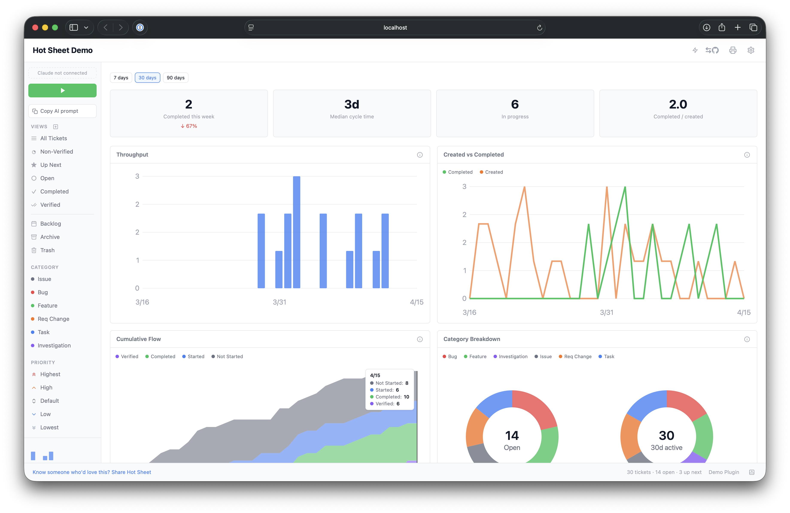
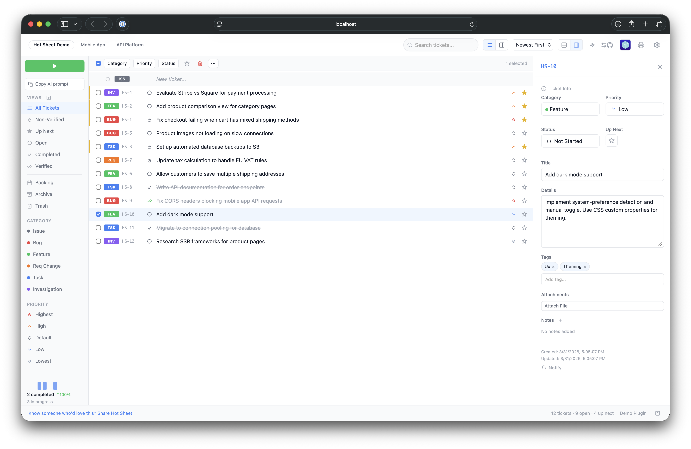
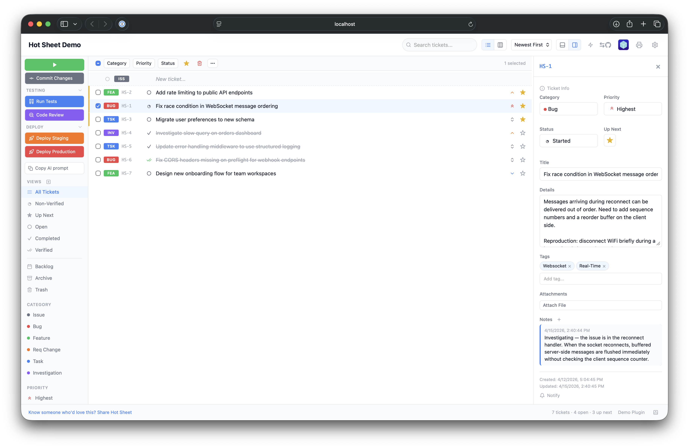

<div align="center">

# Hot Sheet

### A fast, local ticket tracker that feeds your AI coding tools.

<br>

**Hot Sheet** is a lightweight project management tool that runs entirely on your machine. Create tickets with a bullet-list interface, drag them into priority order, and your AI tools automatically get a structured worklist they can act on.

No cloud. No logins. No JIRA. Just tickets and a tight feedback loop.

<br>

**Desktop app** (recommended) — download from [GitHub Releases](https://github.com/brianwestphal/hotsheet/releases):

| Platform | Download |
|----------|----------|
| macOS (Apple Silicon) | `.dmg` (arm64) |
| macOS (Intel) | `.dmg` (x64) |
| Linux | `.AppImage` / `.deb` |
| Windows | `.msi` / `.exe` |

After installing, open the app and use **Open Folder** to get started — or click **Install CLI** to add the `hotsheet` command to your PATH for terminal launching.

**Or install via npm:**

```bash
npm install -g hotsheet
```

Then, from any project directory:

```bash
hotsheet
```

That's it. Data stays local.

> **Note:** We're actively developing and testing on macOS. Linux and Windows builds are provided but less tested — if you run into issues on those platforms, we'd love your help! Please [open an issue](https://github.com/brianwestphal/hotsheet/issues).

</div>

<br>

<p align="center">
  
</p>

---

## Why Hot Sheet?

AI coding tools are powerful, but they need direction. You know what needs to be built, fixed, or investigated — but communicating that to your AI tool means typing the same context over and over, or maintaining a text file that drifts out of sync.

Hot Sheet gives you a proper ticket interface — categories, priorities, statuses — with one key difference: it automatically exports a `worklist.md` file that AI tools like Claude Code can read directly. Your tickets become the AI's task list.

The workflow:

1. **You** create and prioritize tickets in Hot Sheet
2. **Hot Sheet** syncs an `Up Next` worklist to `.hotsheet/worklist.md`
3. **Your AI tool** reads the worklist and works through it
4. **You** review, give feedback, and add new tickets

The loop stays tight because the AI always knows what to work on next — and you always know what it's doing.

---

## Features

**Bullet-list input** — type a title, hit Enter, ticket created. Set category and priority inline with keyboard shortcuts.

<p align="center">
  
</p>

**Customizable categories** — defaults to a software development set (Issue, Bug, Feature, Req Change, Task, Investigation), with built-in presets for Design, Product Management, Marketing, and Personal workflows. Each category has a color, badge label, and keyboard shortcut — all configurable in Settings.

<p align="center">
  
</p>

**Column view** — switch to a kanban-style board grouped by status. Drag tickets between columns to change status. Click column headers to select all tickets in a column. Drag onto sidebar items to set category, priority, or view.

<p align="center">
  
</p>

**Batch operations** — select multiple tickets to bulk-update category, priority, status, or Up Next. The overflow menu provides duplicate, tags, mark as read/unread, move to backlog, and archive actions — all with icons. Right-click any ticket for a full context menu with submenus.

<p align="center">
  
</p>

**Detail panel** — side or bottom orientation (toggle in the toolbar), resizable, collapsible. Shows category, priority, status, and Up Next in a compact grid, plus title, details, tags, attachments, and editable notes. Click a note to edit inline; right-click to delete.

<p align="center">
  
</p>

**Unread indicators** — when tickets are created or updated externally (by AI tools, sync plugins, or the API), a blue dot appears next to the title. Your own edits in the UI never trigger unread status. Mark as Read/Unread from the context menu or batch toolbar. Tickets are automatically marked as read when you open them in the detail panel.

**Stats dashboard** — click the sidebar widget to open a full analytics page with throughput charts, created-vs-completed trends, cumulative flow diagram, category breakdown, and cycle time scatter plot. Hover any chart for detailed tooltips.

<p align="center">
  
</p>

**Multi-project tabs** — open multiple projects in a single window. Each project remembers its own sidebar view, settings, sort preferences, and layout. Tabs appear automatically when you register a second project via Open Folder (`Cmd+O`). Drag tabs to reorder, right-click for close options and "Show in Finder," switch with `Cmd+Shift+[/]`.

<p align="center">
  
</p>

**Also includes:**
- **Tags** — free-form tags on tickets, with autocomplete and a batch tag dialog for multi-select
- **Custom views** — create filtered views with an interactive query builder (field + operator + value conditions, AND/OR logic). Associate a tag with a view to enable drag-and-drop tagging and auto-tag on create.
- **Custom ticket prefix** — change the default `HS-` prefix to any project-specific prefix in Settings
- **Five priority levels** — Highest to Lowest, with Lucide chevron icons, sortable and filterable
- **Up Next flag** — star tickets to add them to the AI worklist
- **Drag and drop** — drag tickets onto sidebar views to change category, priority, or status; drop files onto the detail panel to attach; reorder project tabs and custom views
- **Right-click context menus** — full context menu on tickets with category/priority/status submenus, tags, duplicate, mark as read/unread, backlog, archive, delete
- **Search** — full-text search across ticket titles, details, ticket numbers, and tags
- **Print** — print the dashboard, all tickets, selected tickets, or individual tickets in checklist, summary, or full-detail format
- **Keyboard-driven** — `Enter` to create, `Cmd+I/B/F/R/K/G` for categories, `Alt+1-5` for priority, `Cmd+D` for Up Next, `Delete` to trash, `Cmd+P` to print, `Cmd+Z/Shift+Z` for undo/redo
- **Undo/redo** — `Cmd+Z` and `Cmd+Shift+Z` for all operations including notes, batch changes, and deletions
- **Animated transitions** — smooth FLIP animations when tickets reorder after property changes
- **Copy / cut / paste** — `Cmd+C` copies selected tickets (formatted text to clipboard + structured data for paste), `Cmd+X` cuts, `Cmd+V` pastes into the current project with title dedup. Works across projects.
- **File attachments** — attach files via file picker or drag-and-drop onto the detail panel, reveal in file manager
- **Markdown sync** — `worklist.md` and `open-tickets.md` auto-generated on every change
- **Automatic backups** — tiered snapshots (every 5 min, hourly, daily) with preview-before-restore recovery
- **Auto-cleanup** — verified tickets auto-archive after a configurable number of days; trashed tickets auto-delete
- **Portable settings** — all project settings stored in `settings.json` for easy copying between projects
- **App icon variants** — 9 icon variants to choose from in Settings, applied instantly to the dock icon
- **Fully local** — embedded PostgreSQL (PGLite), no network calls, no accounts, no telemetry

---

## AI Integration

The exported worklist is plain markdown. Any AI tool that can read files can use it.

Star tickets as "Up Next" and they appear in the worklist, sorted by priority. As the AI works, it updates ticket status and appends notes — visible right in the detail panel. Tickets modified by the AI show a blue unread dot so you know what to review.

<p align="center">
  
</p>

### Claude Code

Point Claude Code at your worklist:

```
Read .hotsheet/worklist.md and work through the tickets in order.
```

Or add it to your `CLAUDE.md`:

```markdown
Read .hotsheet/worklist.md for current work items.
```

Hot Sheet automatically generates skill files for Claude Code (as well as Cursor, GitHub Copilot, and Windsurf) so your AI tool can create tickets directly. Run `/hotsheet` in Claude Code to process the worklist.

### Claude Channel Integration (Experimental)

Hot Sheet can push events directly to a running Claude Code session via MCP channels. Enable it in Settings:

- **Play button** — appears in the sidebar. Single-click sends the worklist to Claude on demand. Pending worklist changes are flushed immediately so the AI always reads up-to-date data.
- **Auto mode** — double-click the play button to enable automatic mode. Claude is triggered immediately, then continues monitoring for new Up Next items with debounce. Exponential backoff prevents runaway retries.
- **Auto-prioritize** — when no tickets are flagged as Up Next, Claude automatically evaluates open tickets and picks the most important ones to work on.
- **Feedback loop** — Claude can request user input by adding notes prefixed with `FEEDBACK NEEDED:` or `IMMEDIATE FEEDBACK NEEDED:`. A dialog appears in the UI for the user to respond, and Claude is automatically re-triggered with the feedback. Blue dots on project tabs indicate pending feedback.
- **Custom commands** — create named buttons that send custom prompts to Claude **or run shell commands** directly. Organize into collapsible groups. Toggle between "Claude Code" and "Shell" targets per command. Shell commands execute server-side with stdout/stderr captured to the commands log.
- **Permission relay** — when Claude needs tool approval (Bash, Edit, etc.), a full-screen overlay shows the tool name and command preview with Allow/Deny/Dismiss buttons — no need to switch to the terminal.
- **Commands log** — a resizable bottom panel that records all communication: triggers, completions, permission requests, and shell command output. Filter by type, search, and copy entries. Shell commands show a stop button for running processes.
- **Status indicator** — shows "Claude working" / "Shell running" / idle in the footer.

Requires Claude Code v2.1.80+ with channel support. See [docs/12-claude-channel.md](docs/12-claude-channel.md) for setup details.

<p align="center">
  
</p>

### Other AI Tools

The worklist works with any AI tool that reads files — Cursor, Copilot, Aider, etc. Each ticket includes its number, type, priority, status, title, and details.

### What gets exported

`worklist.md` contains all tickets flagged as "Up Next," sorted by priority:

```
# Hot Sheet - Up Next

These are the current priority work items. Complete them in order of priority, where reasonable.

---

TICKET HS-12:
- Type: bug
- Priority: highest
- Status: not started
- Title: Fix login redirect loop
- Details: After session timeout, the redirect goes to /login?next=/login...

---

TICKET HS-15:
- Type: feature
- Priority: high
- Status: started
- Title: Add CSV export for reports
```

---

## Plugins

Hot Sheet supports plugins for syncing with external ticketing systems and adding custom functionality. Plugins are loaded from `~/.hotsheet/plugins/` and configured per-project.

### GitHub Issues (bundled)

The GitHub Issues plugin ships with Hot Sheet and syncs tickets bidirectionally:
- Pull issues from GitHub, push local tickets to GitHub
- Map categories, priorities, and statuses via configurable labels
- Sync notes as GitHub comments, push attachments via the Contents API
- Toolbar sync button with busy indicator

Configure it in Settings → Plugins with your GitHub PAT and repository details.

### Building Plugins

Plugins are ESM JavaScript modules with a `manifest.json`. They can:
- **Sync tickets** with any external system (Linear, Jira, Trello, Asana, etc.)
- **Add UI elements** — toolbar buttons, sidebar actions, context menu items
- **Run custom actions** — export, notifications, webhooks, automation

See **[`docs/plugin-development-guide.md`](docs/plugin-development-guide.md)** for the complete plugin API reference, including a full Linear plugin skeleton and standalone TypeScript types. The guide is designed to be read by both humans and AI coding assistants — point Claude Code or another AI tool at it to generate plugins for systems it already knows.

---

## Backups & Data Safety

Hot Sheet automatically protects your data with tiered backups and instance locking.

### Automatic backups

Backups run on three schedules, each keeping a rolling window of snapshots:

| Tier | Frequency | Retention |
|------|-----------|-----------|
| Recent | Every 5 minutes | Last hour (up to 12) |
| Hourly | Every hour | Last 12 hours (up to 12) |
| Daily | Every day | Last 7 days (up to 7) |

You can also trigger a manual backup at any time from the settings panel with the **Backup Now** button.

### Recovering from a backup

Open the settings panel (gear icon) to see all available recovery points grouped by tier. Click any backup to enter **preview mode** — the app switches to a read-only view of the backup's data. You can navigate views, filter by category/priority, switch to column layout, and inspect individual tickets to verify it's the right recovery point.

If it looks correct, click **Restore This Backup** to replace the current database. A safety snapshot of your current data is automatically created before the restore, so you can always go back.

### Configurable backup location

By default, backups are stored in `.hotsheet/backups/`. To store them elsewhere — for example, a folder synced by iCloud, Google Drive, or Dropbox — set the `backupDir` in `.hotsheet/settings.json`:

```json
{
  "backupDir": "/Users/you/Library/Mobile Documents/com~apple~CloudDocs/hotsheet-backups"
}
```

This can also be changed from the settings panel UI.

### Instance locking

Only one Hot Sheet instance can use a data directory at a time. If you accidentally start a second instance pointing at the same `.hotsheet/` folder, it will exit with a clear error instead of risking database corruption. The lock is automatically cleaned up when the app stops.

---

## Install

### Desktop app (recommended)

Download the latest release for your platform from [GitHub Releases](https://github.com/brianwestphal/hotsheet/releases).

On first launch, use **Open Folder** to point the app at your project directory. The app remembers your projects and reopens them on subsequent launches. Optionally install the CLI for terminal-based launching:

**macOS:**
```bash
sudo sh -c 'mkdir -p /usr/local/bin && ln -sf "/Applications/Hot Sheet.app/Contents/Resources/resources/hotsheet" /usr/local/bin/hotsheet'
```

**Linux:**
```bash
ln -sf /path/to/hotsheet/resources/hotsheet-linux ~/.local/bin/hotsheet
```

The desktop app includes automatic updates — new versions are downloaded and applied in the background.

### npm

Alternatively, install via npm (runs in your browser instead of a native window):

```bash
npm install -g hotsheet
```

Requires **Node.js 20+**.

---

## Usage

```bash
# Start from your project directory
hotsheet

# Custom port (npm version only)
hotsheet --port 8080

# Custom data directory
hotsheet --data-dir ~/projects/my-app/.hotsheet

# Force browser mode (desktop app)
hotsheet --browser
```

### Options

| Flag | Description |
|------|-------------|
| `--port <number>` | Port to run on (default: 4174) |
| `--data-dir <path>` | Data directory (default: `.hotsheet/`) |
| `--no-open` | Don't open the browser on startup |
| `--strict-port` | Fail if the requested port is in use |
| `--browser` | Open in browser instead of desktop window |
| `--check-for-updates` | Check for new versions |
| `--help` | Show help |

### Settings file

All project settings are stored in `.hotsheet/settings.json`. You can copy this file between projects to share configuration:

```json
{
  "appName": "HS - My Project",
  "ticketPrefix": "PROJ",
  "backupDir": "/path/to/backup/location"
}
```

| Key | Description |
|-----|-------------|
| `appName` | Custom window title and tab name (defaults to the project folder name) |
| `backupDir` | Backup storage path (defaults to `.hotsheet/backups/`) |
| `ticketPrefix` | Custom ticket number prefix (defaults to `HS`) |
| `appIcon` | Icon variant (`default`, `variant-1` through `variant-9`) |

UI preferences (detail panel position, sort order, categories, custom views, custom commands, etc.) are also stored in this file and transfer automatically when you copy it.

All settings can also be changed from the settings panel UI.

### Keyboard shortcuts

| Shortcut | Action |
|----------|--------|
| `Enter` | Create new ticket |
| `Cmd+I/B/F/R/K/G` | Set category (customizable) |
| `Alt+1-5` | Set priority (Highest to Lowest) |
| `Cmd+D` | Toggle Up Next |
| `Delete` / `Backspace` | Delete selected tickets |
| `Cmd+C` | Copy ticket info |
| `Cmd+X` | Cut tickets |
| `Cmd+V` | Paste tickets |
| `Cmd+A` | Select all |
| `Cmd+Z` | Undo |
| `Cmd+Shift+Z` | Redo |
| `Cmd+P` | Print |
| `Cmd+F` | Focus search |
| `Cmd+N` / `N` | Focus new ticket input |
| `Cmd+O` | Open folder (add project) |
| `Cmd+,` | Settings |
| `Cmd+Shift+[` / `]` | Switch project tab |
| `Cmd+Alt+W` | Close active tab |
| `Escape` | Blur field / clear selection / close |

---

## Architecture

| Layer | Technology |
|-------|-----------|
| Desktop | Tauri v2 (native window, auto-updates) |
| CLI | TypeScript, Node.js |
| Server | Hono |
| Database | PGLite (embedded PostgreSQL) |
| UI | Custom server-side JSX (no React), vanilla client JS |
| Charts | Inline SVG (no external chart library) |
| Build | tsup (server + client bundles), sass (SCSS) |
| Storage | `.hotsheet/` in your project directory |

Data stays local. No network calls, no accounts, no telemetry.

---

## Development

```bash
git clone <repo-url>
cd hotsheet
npm install

npm run dev              # Build client assets, then run via tsx
npm run build            # Build to dist/cli.js
npm test                 # Unit tests with coverage (626 tests)
npm run test:e2e         # E2E browser tests (120+ tests)
npm run test:fast        # Unit + fast E2E (skips GitHub plugin tests)
npm run test:all         # Merged coverage report (unit + E2E)
npm run lint             # ESLint
npm run clean            # Remove dist and caches
npm link                 # Symlink for global 'hotsheet' command
```

The project has comprehensive test coverage with 626 unit tests (vitest) and 120+ Playwright E2E browser tests, plus smoke tests for production install verification.

---

## See Also

- **[Glassbox](https://github.com/brianwestphal/glassbox)** — AI-powered code review tool. Runs locally, reviews your changes, and posts inline annotations. Pairs well with Hot Sheet for a complete local dev workflow.

---

## License

MIT
