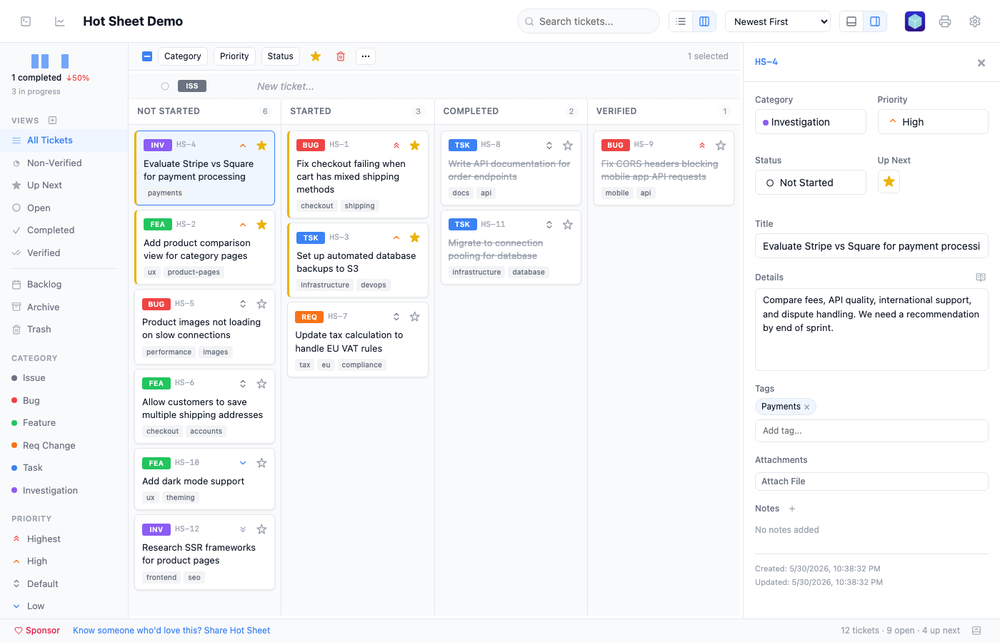
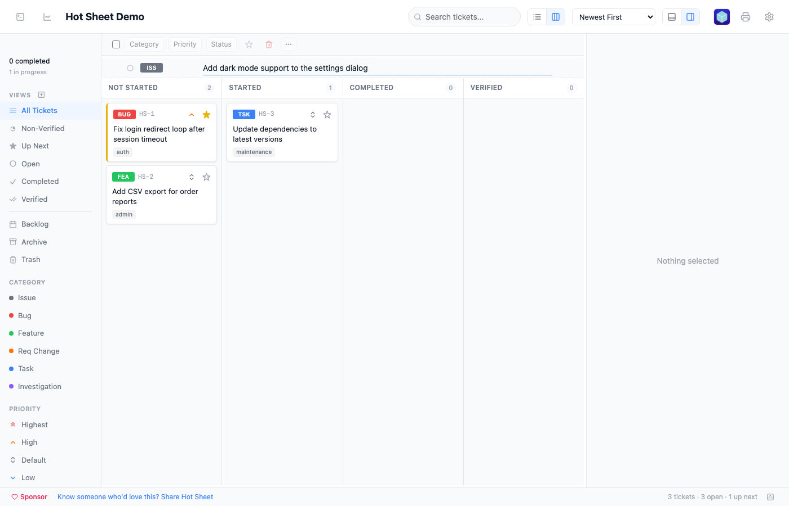
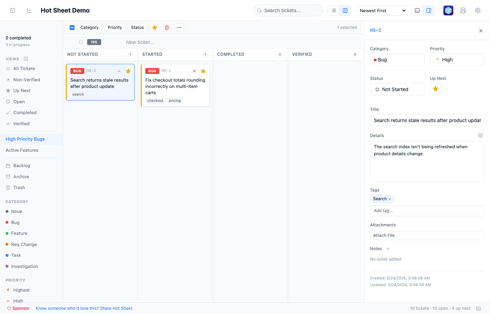
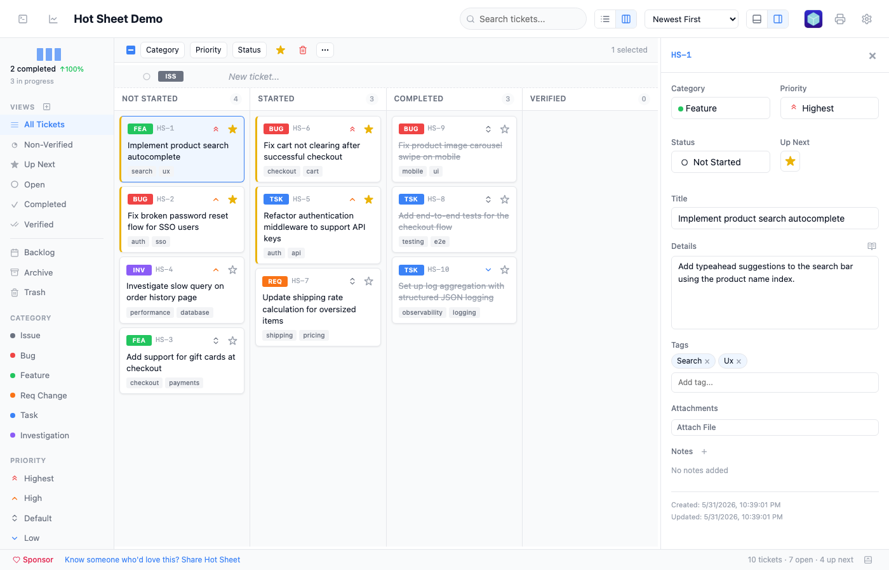
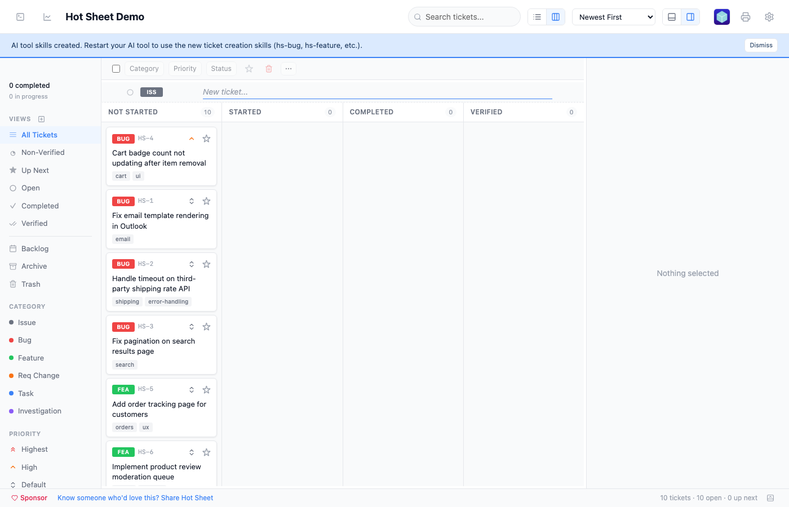
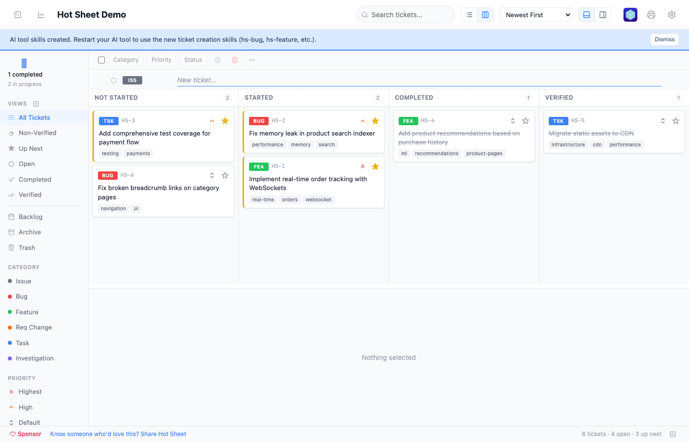
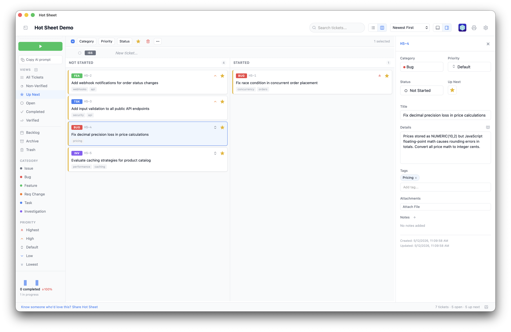

<div align="center">

# Hot Sheet

### A fast, local ticket tracker that feeds your AI coding tools.

<br>

**Hot Sheet** is a lightweight project management tool that runs entirely on your machine. Create tickets with a bullet-list interface, drag them into priority order, and your AI tools automatically get a structured worklist they can act on.

No cloud. No logins. No JIRA. Just tickets and a tight feedback loop.

<br>

**Desktop app** (recommended) — download from [GitHub Releases](https://github.com/brianwestphal/hotsheet/releases):

| Platform | Download |
|----------|----------|
| macOS (Apple Silicon) | `.dmg` (arm64) |
| macOS (Intel) | `.dmg` (x64) |
| Linux | `.AppImage` / `.deb` |
| Windows | `.msi` / `.exe` |

After installing, open the app and click **Install CLI** to add the `hotsheet` command to your PATH.

**Or install via npm:**

```bash
npm install -g hotsheet
```

Then, from any project directory:

```bash
hotsheet
```

That's it. Data stays local.

> **Note:** We're actively developing and testing on macOS. Linux and Windows builds are provided but less tested — if you run into issues on those platforms, we'd love your help! Please [open an issue](https://github.com/brianwestphal/hotsheet/issues).

</div>

<br>

<p align="center">
  
</p>

---

## Why Hot Sheet?

AI coding tools are powerful, but they need direction. You know what needs to be built, fixed, or investigated — but communicating that to your AI tool means typing the same context over and over, or maintaining a text file that drifts out of sync.

Hot Sheet gives you a proper ticket interface — categories, priorities, statuses — with one key difference: it automatically exports a `worklist.md` file that AI tools like Claude Code can read directly. Your tickets become the AI's task list.

The workflow:

1. **You** create and prioritize tickets in Hot Sheet
2. **Hot Sheet** syncs an `Up Next` worklist to `.hotsheet/worklist.md`
3. **Your AI tool** reads the worklist and works through it
4. **You** mark tickets complete and add new ones

The loop stays tight because the AI always knows what to work on next.

---

## Features

**Bullet-list input** — type a title, hit Enter, ticket created. Set category and priority inline with keyboard shortcuts.

<p align="center">
  
</p>

**Six ticket categories** — Issue, Bug, Feature, Requirement Change, Task, Investigation — each with a distinct color. **Sidebar filtering** lets you drill down by view, category, or priority.

<p align="center">
  
</p>

**Column view** — switch to a kanban-style board grouped by status. Drag tickets between columns to change status, or drag onto sidebar items to set category, priority, or view.

<p align="center">
  
</p>

**Batch operations** — select multiple tickets to bulk-update category, priority, status, or Up Next. Multi-select works in both list and column views.

<p align="center">
  
</p>

**Detail panel** — side or bottom orientation (toggle in the toolbar), resizable, with fields for title, details, attachments, and timestamped notes. Auto-shows when you select a ticket.

<p align="center">
  
</p>

**Also includes:**
- **Five priority levels** — Highest to Lowest, sortable and filterable
- **Up Next flag** — star tickets to add them to the AI worklist
- **Drag and drop** — drag tickets onto sidebar views to change category, priority, or status
- **Search** — full-text search across ticket titles and details
- **Keyboard-driven** — `Enter` to create, `Cmd+I/B/F/R/K/G` for categories, `Alt+1-5` for priority, `Cmd+D` for Up Next, `Cmd+C` to copy
- **Copy for commits** — `Cmd+C` copies selected ticket info (number + title) for use in commit messages
- **File attachments** — attach files to any ticket
- **Markdown sync** — `worklist.md` and `open-tickets.md` auto-generated on every change
- **Auto-cleanup** — configurable auto-deletion of old trash and verified items
- **Fully local** — embedded PostgreSQL (PGLite), no network calls, no accounts, no telemetry

---

## AI Integration

The exported worklist is plain markdown. Any AI tool that can read files can use it.

Star tickets as "Up Next" and they appear in the worklist, sorted by priority. As the AI works, it updates ticket status and appends notes — visible right in the detail panel.

<p align="center">
  
</p>

### Claude Code

Point Claude Code at your worklist:

```
Read .hotsheet/worklist.md and work through the tickets in order.
```

Or add it to your `CLAUDE.md`:

```markdown
Read .hotsheet/worklist.md for current work items.
```

### Other AI Tools

The worklist works with any AI tool that reads files — Cursor, Copilot, Aider, etc. Each ticket includes its number, type, priority, status, title, and details.

### What gets exported

`worklist.md` contains all tickets flagged as "Up Next," sorted by priority:

```
# Hot Sheet - Up Next

These are the current priority work items. Complete them in order of priority, where reasonable.

---

TICKET HS-12:
- Type: bug
- Priority: highest
- Status: not started
- Title: Fix login redirect loop
- Details: After session timeout, the redirect goes to /login?next=/login...

---

TICKET HS-15:
- Type: feature
- Priority: high
- Status: started
- Title: Add CSV export for reports
```

---

## Install

### Desktop app (recommended)

Download the latest release for your platform from [GitHub Releases](https://github.com/brianwestphal/hotsheet/releases).

On first launch, the app will prompt you to install the `hotsheet` CLI command. This creates a symlink so you can launch the desktop app from any project directory. You can also install it manually:

**macOS:**
```bash
sudo ln -sf "/Applications/Hot Sheet.app/Contents/Resources/resources/hotsheet" /usr/local/bin/hotsheet
```

**Linux:**
```bash
ln -sf /path/to/hotsheet/resources/hotsheet-linux ~/.local/bin/hotsheet
```

The desktop app includes automatic updates — new versions are downloaded and applied in the background.

### npm

Alternatively, install via npm (runs in your browser instead of a native window):

```bash
npm install -g hotsheet
```

Requires **Node.js 20+**.

---

## Usage

```bash
# Start from your project directory
hotsheet

# Custom port (npm version only)
hotsheet --port 8080

# Custom data directory
hotsheet --data-dir ~/projects/my-app/.hotsheet

# Force browser mode (desktop app)
hotsheet --browser
```

### Options

| Flag | Description |
|------|-------------|
| `--port <number>` | Port to run on (default: 4174) |
| `--data-dir <path>` | Data directory (default: `.hotsheet/`) |
| `--browser` | Open in browser instead of desktop window |
| `--help` | Show help |

### Customizing the window title

When running multiple instances, you can customize the window title to tell them apart. Create `.hotsheet/settings.json` in your project:

```json
{
  "appName": "HS - My Project"
}
```

Without a settings file, the window title defaults to the project folder name.

### Keyboard shortcuts

| Shortcut | Action |
|----------|--------|
| `Enter` | Create new ticket |
| `Cmd+I` | Set category: Issue |
| `Cmd+B` | Set category: Bug |
| `Cmd+F` | Set category: Feature |
| `Cmd+R` | Set category: Req Change |
| `Cmd+K` | Set category: Task |
| `Cmd+G` | Set category: Investigation |
| `Alt+1-5` | Set priority (Highest to Lowest) |
| `Cmd+D` | Toggle Up Next |
| `Cmd+C` | Copy ticket info (number + title) |
| `Cmd+A` | Select all |
| `Escape` | Clear selection / close |

---

## Architecture

| Layer | Technology |
|-------|-----------|
| Desktop | Tauri v2 (native window, auto-updates) |
| CLI | TypeScript, Node.js |
| Server | Hono |
| Database | PGLite (embedded PostgreSQL) |
| UI | Custom server-side JSX (no React), vanilla client JS |
| Build | tsup (single-file bundle) |
| Storage | `.hotsheet/` in your project directory |

Data stays local. No network calls, no accounts, no telemetry.

---

## Development

```bash
git clone <repo-url>
cd hotsheet
npm install

npm run dev              # Build client assets, then run via tsx
npm run build            # Build to dist/cli.js
npm run clean            # Remove dist and caches
npm link                 # Symlink for global 'hotsheet' command
```

---

## License

MIT
