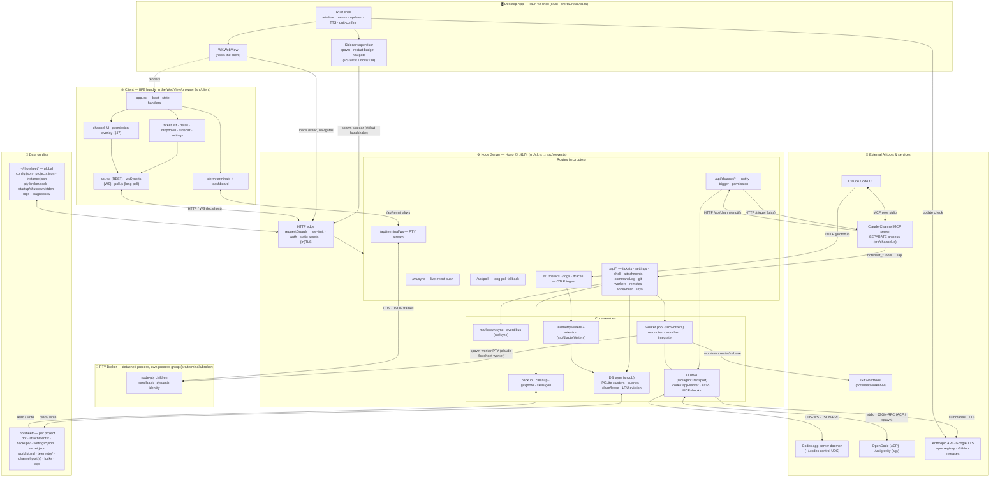
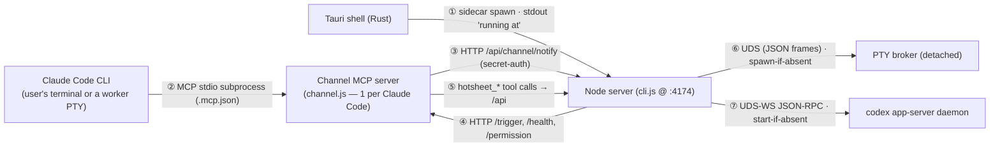
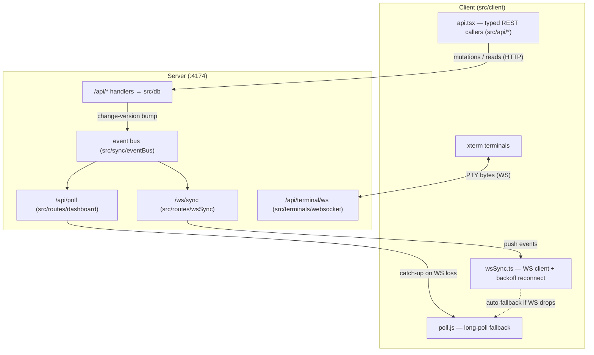
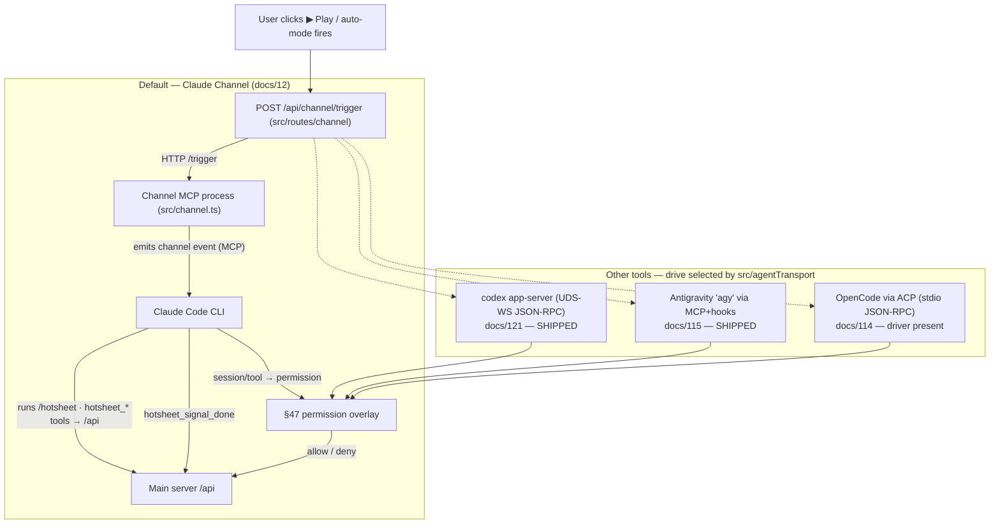
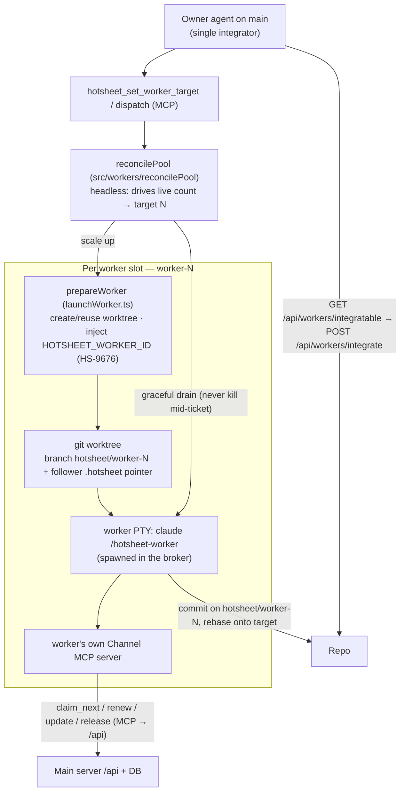
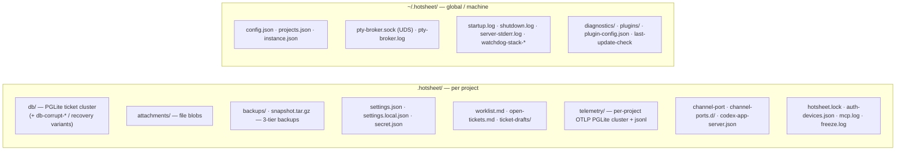

# Hot Sheet — Architecture Diagram

A visual, end-to-end map of how Hot Sheet is put together, covering both the **app side** (the Tauri desktop shell + the browser/WebView client) and the **server side** (the Node/Hono server, PGLite, and every subsystem it hosts), plus the pieces that straddle the two — the Claude Channel MCP bridge, the detached terminal broker, the distributed worker pool, and the AI drive transports.

Everything runs **locally**. The only outbound network is update checks (npm / GitHub) and, when the relevant features are on, AI-provider calls (Anthropic API, Google TTS). Grounded in the code as of 2026-08-17; anchor files are cited per section. For behavior detail see the numbered `docs/*` requirements docs and `docs/ai/code-summary.md`.

> Diagrams are Mermaid — they render on GitHub and in the Hot Sheet reader. **SHIPPED** vs **design/partial** status is called out where it matters (see the status table at the end).

---

## A. System overview

The whole picture: five process groups (desktop shell, client, Node server, terminal broker, and the external AI tools), the data on disk, and the transports between them.

**Reading it:** the desktop shell is only a launcher + host — it spawns the Node server as a sidecar and points the WebView at it. The client is a normal web app talking to `localhost:4174`. Everything with real logic lives in the Node server. The Claude Channel, terminal broker, codex daemon, and worker agents are *separate processes* the server coordinates with over stdio / HTTP / UDS.

---

## B. Processes & IPC

Who spawns whom, and over what transport. This is the "server and app sides" split made concrete.

| # | Edge | Transport | Anchor |
|---|------|-----------|--------|
| ① | Tauri → Node | Tauri shell-plugin **sidecar** spawns `hotsheet-node` running bundled `server/cli.js`; handshake on the stdout "running at" line; bounded auto-restart supervisor | `src-tauri/src/lib.rs` (`build_and_spawn_sidecar`, `spawn_sidecar_and_navigate`), `tauri.conf.json` (`externalBin`) |
| ② | Claude Code → Channel | **MCP over stdio**; Claude Code launches the channel as an MCP subprocess declared in `.mcp.json` (`hotsheet-channel-<slug>`). One channel process per Claude Code instance | `src/channel.ts`, `src/channel-config.ts` |
| ③ | Channel → Node | **HTTP** POST to `/api/channel/notify`, authenticated with the project's `secret.json` sidecar secret | `src/channel.ts` (`notifyMainServer`), `src/routes/channel.ts` |
| ④ | Node → Channel | **HTTP** to the channel's ephemeral port (discovered via `.hotsheet/channel-port` + per-PID registry); play button ⇒ `/trigger` | `src/channel-config.ts`, `src/channelRegistry.ts`, `src/routes/channel.ts` |
| ⑤ | Channel → Node | The `hotsheet_*` **MCP tools** (ticket CRUD, batch, notes, claim/lease, worker pool, announce, signal-done) are HTTP calls back into `/api/*` | `src/channel.tools.ts` |
| ⑥ | Node → Broker | **Unix-domain socket**, newline-delimited JSON (base64 for PTY bytes); broker is a **detached** process (own process group) so it survives an accidental server death and re-adopts sessions on reconnect | `src/terminals/broker/*`, `src/terminals/registry/brokerMode.ts` |
| ⑦ | Node → codex | **WebSocket over UDS** (`ws+unix://`), one JSON-RPC message per frame, to the shared codex `app-server` daemon (started if absent); stdio-child fallback | `src/codexAppServer.ts`, `src/codexDaemonTransport.ts` |

**Dev vs packaged.** In dev the server is `node --import tsx src/cli.ts` (single process, so its PID is the killable server) and the broker/channel run via `tsx` too; the packaged app runs the tsup-built `cli.js` / `channel.js` / `ptyBrokerEntry.js` (`src-tauri/src/lib.rs::build_dev_server_args`).

---

## C. Client ↔ server transport

Three cooperating channels on the one Hono port, plus a separate PTY stream.

- **REST** — every client call goes through a typed caller in `src/api/*` (single source of truth for wire shapes; docs/9). Mutations bump a change-version.
- **WebSocket `/ws/sync`** — the live path (docs/93): the server's event bus pushes changes to all tabs; the client reducer applies them, with `?since` catch-up + exponential-backoff reconnect.
- **Long-poll `/api/poll`** — additive fallback that stays working if the WS drops.
- **Terminal `/api/terminal/ws`** — a *separate* WS carrying raw PTY bytes; on the server side it relays to the broker over the UDS (§B ⑥). On checkout/reconnect it replays scrollback history (docs/54).

---

## D. Claude Channel & AI drive

How Hot Sheet drives an AI agent. The default is the **Claude Channel** (a persistent MCP process); other tools use their own drive transport, selected per tool by `src/agentTransport.ts` / `src/aiTools/registry.ts` (docs/117).

- **`claude-channel`** (default): persistent MCP process; `session/request_permission`-style prompts surface in the in-app §47 overlay; MCP tool calls route back into `/api`.
- **`codex` app-server** (docs/121, SHIPPED): drive over the codex daemon's control UDS so external codex UIs can watch the same driven thread (model-B, docs/129); approvals + MCP elicitations bridge to the §47 overlay.
- **`acp`** (docs/114): OpenCode et al. over the Agent Client Protocol (stdio JSON-RPC); pure mapping core shipped, driver present.
- **`mcp-hooks`** (docs/115, SHIPPED for Antigravity): MCP-native agents on Claude's rails; a PreToolUse hook polls the channel's `/permission/decision`.

---

## E. Distributed worker pool

Parallel AI agents, each in its own git worktree, all feeding one Hot Sheet (docs/89–92, 100). The owner (running on `main`) is the single integrator.

- Workers **self-claim** tickets via the claim/lease primitive (atomic `claim-next` with `SKIP LOCKED`) or are **dispatched** to by the owner; the lease id (`worker-1`) is injected as `HOTSHEET_WORKER_ID` so a reused worktree (`hotsheet-worker-1-12`) still claims under the right identity (HS-9676, `src/workerIdentity.ts`).
- Each worker runs its **own channel MCP server** against the owner data dir, so its permission prompts + tool calls surface in the owner's UI.
- Workers **never write the target branch** — they commit on `hotsheet/worker-N` and rebase to stay current; the owner integrates ready branches with the guarded `integrate` helper (optional in-merge gate).

---

## F. Data on disk

Nothing leaves the machine. Per-project state lives in `.hotsheet/`; cross-project + machine state in `~/.hotsheet/`.

The **live DB** is `.hotsheet/db/` and is never on the (user-configurable) backup filesystem. `backupDir` / `dataDir` may point at cloud drives, so all access to them goes through the hardened `src/backupFs.ts` / streaming attachment paths (docs/7, CLAUDE.md). PGLite clusters are memory-bounded by an LRU + idle-close + pressure-aware policy (docs/128, 131).

---

## G. Telemetry ingest

Claude Code emits OpenTelemetry to the same Hono port; it lands in per-project telemetry clusters (docs/67).

```mermaid
flowchart LR
  ccli["Claude Code<br/>(spawned by a Hot Sheet terminal)"]
  env["env: CLAUDE_CODE_ENABLE_TELEMETRY=1<br/>OTEL_EXPORTER_OTLP_ENDPOINT=http://localhost:PORT<br/>(src/terminals/registry/otelEnv.ts)"]
  route["/v1/metrics · /logs · /traces<br/>(src/routes/otel.ts — protobuf/JSON)"]
  gate["row cap · unknown-project drop (§67.8)"]
  writers["otelWriters (src/db/otelWriters)"]
  tcl["per-project telemetry PGLite<br/>.hotsheet/telemetry/db"]
  dash["Analytics dashboards<br/>(docs/70, 71)"]

  ccli --> env --> route --> gate --> writers --> tcl --> dash
```

The OTLP `hotsheet_project` resource attribute (= project secret) maps a batch to its project's telemetry cluster; rows for unknown projects are dropped. Retention is a periodic sweep with per-table windows + a span row cap (docs/85). Dashboards read the clusters for cost/usage views.

---

## Shipped vs design status

| Component | Status |
|---|---|
| Tauri sidecar spawn of `cli.js` + supervisor | **SHIPPED** |
| Main server (Hono :4174) + `/ws/sync` + `/api/poll` + `/api/terminal/ws` | **SHIPPED** |
| Claude Channel MCP (stdio + localhost HTTP) | **SHIPPED** |
| PTY broker (detached, UDS) | **SHIPPED** — default ON (macOS/Linux); Windows OFF pending verify; packaged-beta path untested |
| Worker pool (worktree Claude PTYs + headless reconciler) | **SHIPPED**; server-driven launch + prompt/coordinator UX partly design (docs/100–102) |
| Drive: `claude-channel` | **SHIPPED** |
| Drive: `codex` app-server (UDS-WS + stdio fallback) | **SHIPPED** |
| Drive: `mcp-hooks` | **SHIPPED** for Antigravity; generalized selection pending |
| Drive: `acp` (OpenCode) | Design + spike done; driver code present |
| OTLP telemetry ingest → per-project PGLite | **SHIPPED** |
| Remote access over mTLS (client half) | Server SHIPPED; client half design (docs/112) |

---

*Anchor files:* `src-tauri/src/lib.rs`, `tauri.conf.json`, `src/cli.ts`, `src/server.ts`, `src/channel.ts`, `src/channel-config.ts`, `src/routes/{channel,wsSync,dashboard,otel}.ts`, `src/terminals/{websocket.ts,broker/*,registry/brokerMode.ts}`, `src/workers/{launchWorker,reconcilePool}.ts`, `src/workerIdentity.ts`, `src/agentTransport.ts`, `src/aiTools/registry.ts`, `src/codexAppServer.ts`, `src/codexDaemonTransport.ts`, `src/acp/acpDrive.ts`, `src/antigravityDrive.ts`, `src/db/{connection,otelWriters}.ts`.
